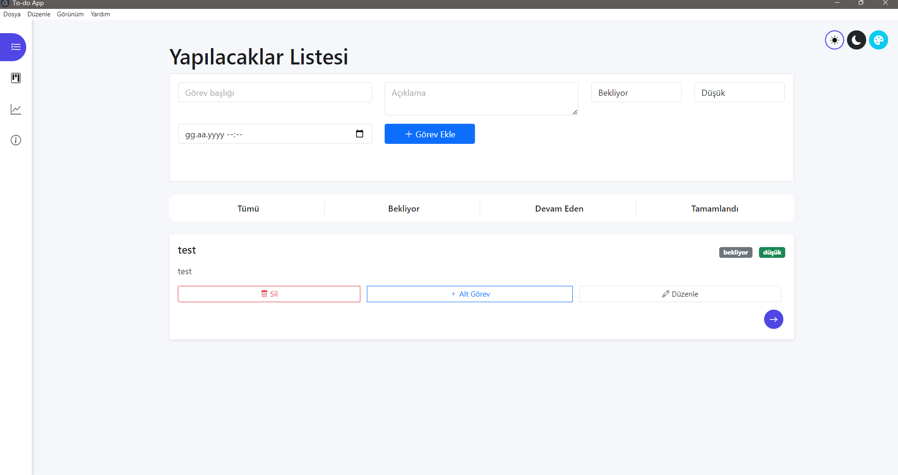
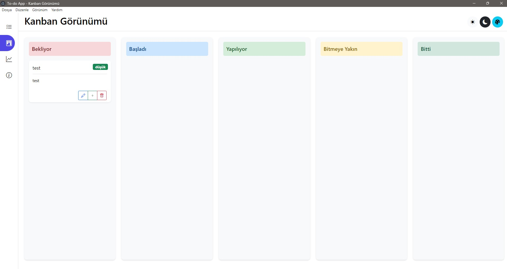
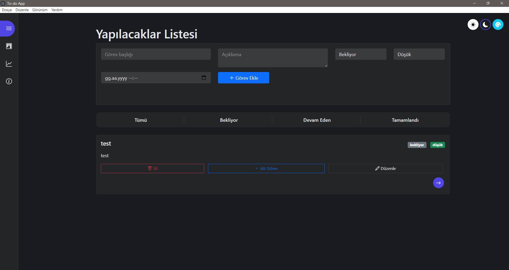
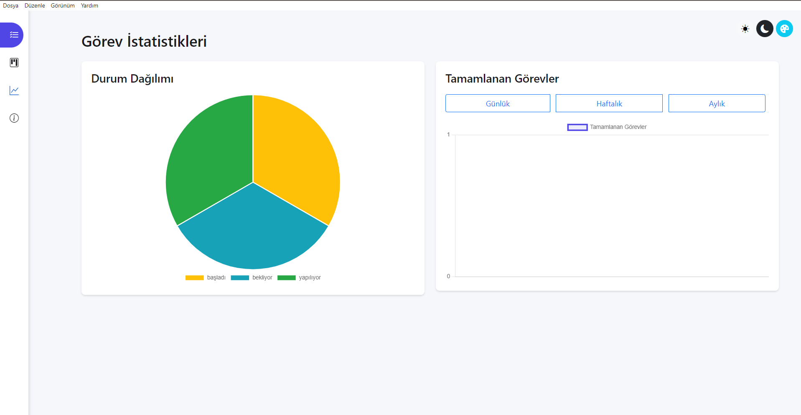

# To-do App

Modern ve gelişmiş görev yönetim uygulaması.

<p align="center">
  
</p>

## Özellikler

- **Çoklu Görünüm**: Görevlerinizi Liste ve Kanban görünümlerinde yönetin
- **Özelleştirilebilir Temalar**: Açık, Koyu ve Renkli temalarla çalışma ortamınızı kişiselleştirin
- **Alt Görevler**: Karmaşık görevleri daha küçük, yönetilebilir alt görevlere bölün
- **İstatistikler**: Görev tamamlama performansınızı görsel grafiklerle takip edin
- **Durum İzleme**: Görevlerinizin ilerlemesini beş farklı aşamada takip edin
  - Bekliyor
  - Başladı
  - Yapılıyor
  - Bitmeye Yakın
  - Bitti
- **Öncelik Seviyeleri**: Görevlerinizi düşük, orta ve yüksek öncelik olarak kategorilendirin
- **Sürükle ve Bırak**: Kanban görünümünde kolay görev yönetimi

## Ekran Görüntüleri

<p align="center">
  
  
</p>

<p align="center">
  
  
</p>

## Kullanılan Teknolojiler

- **Electron.js**: Masaüstü uygulama geliştirme
- **SQLite**: Yerel veritabanı yönetimi
- **Bootstrap 5**: Kullanıcı arayüzü bileşenleri
- **Chart.js**: Interaktif istatistik grafikleri

## Kurulum

1. Bu depoyu bilgisayarınıza klonlayın
   ```bash
   git clone https://github.com/AliKaaN/todo-app-v2.git
   ```

2. Proje dizinine gidin
   ```bash
   cd todo-app-v2
   ```

3. Bağımlılıkları yükleyin
   ```bash
   npm install
   ```

4. Uygulamayı başlatın
   ```bash
   npm start
   ```

## Geliştirme

Bu proje, çapraz platform masaüstü uygulama geliştirmek için Electron kullanmaktadır.
